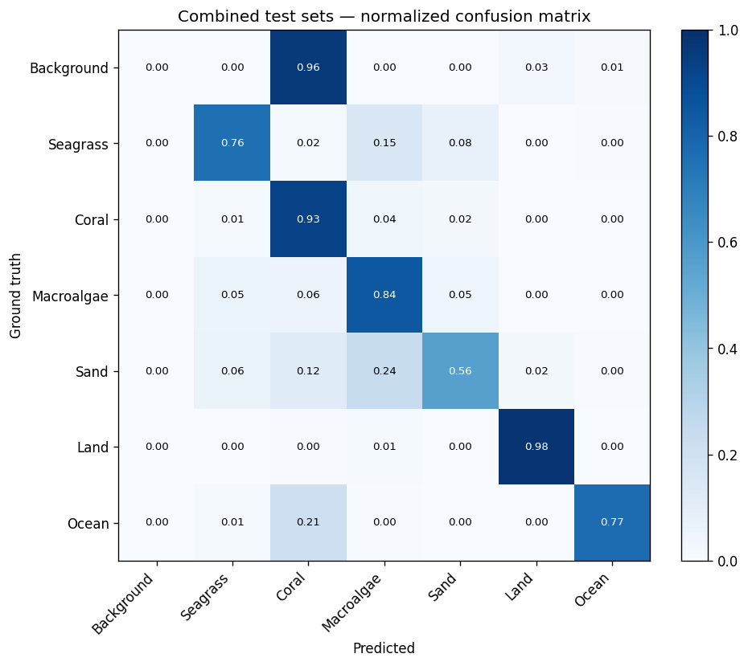

# Benthic Habitat Segmentation using Pre-Trained Encoder UNet on 8-Band WorldView-3 Imagery

Semantic segmentation of benthic habitats from 8-band WorldView-3 satellite imagery. A UNet built with [`segmentation_models_pytorch`](https://github.com/qubvel/segmentation_models_pytorch), adapted from 3-channel ImageNet pretraining to 8-channel multispectral input, trained with a hybrid Dice + weighted Cross-Entropy loss, and evaluated with per-class metrics and full confusion matrices.

**Result**: macro-Dice **0.65** on the in-distribution test region (Agana Bay, 15 images) and **0.52** on the held-out out-of-distribution region (Manell-Geus, 6 images), trained on just 9 labeled WorldView-3 images via patch-based random sampling and full-resolution tile-and-stitch inference.

---

## Problem

Mapping coral reefs and coastal habitats from satellite imagery is a hard problem: water attenuates red wavelengths, shallow substrate colors look similar, and training data is scarce. 8-band WorldView-3 imagery carries information (Coastal Blue at 427nm for water penetration, Red Edge at 724nm for submerged vegetation, two NIR bands) that RGB cannot replicate so the model learns to exploit those bands to distinguish submerged Seagrass from Macroalgae and shallow Coral from Sand.

**Classes** (7, from the dataset's label palette):

| Class | Color |
|---|---|
| 0 — Background | ⬛ `(0, 0, 0)` |
| 1 — Seagrass | 🟩 `(134, 164, 117)` |
| 2 — Coral | 🟧 `(255, 127, 80)` |
| 3 — Macroalgae | 🟢 `(101, 138, 42)` |
| 4 — Sand | 🟨 `(203, 189, 147)` |
| 5 — Land | 🟫 `(139, 98, 76)` |
| 6 — Ocean | 🟦 `(127, 205, 255)` |

---

## Dataset

- **Training**: 9 labeled 8-band WV3 GeoTIFFs (uint16 DN) with paired single-band class-index annotations (`{0..6}`).
- **Agana Bay test (in-distribution)**: 15 clips. RGB PNG annotations, decoded to class indices via the dataset palette.
- **Manell-Geus test (out-of-distribution)**: 6 clips from a different geographic region.

**Challenge**: The extremely small training set (9 images) is the core modeling challenge and the reason pretrained encoders matter here. ImageNet features give the model a head start that a from-scratch model cannot match at this scale.

All three splits are untouched from the original data; nothing is merged across splits.

---

## Methodology

### Conventional approach vs. this project

Most introductory UNet tutorials code an encoder-decoder from scratch with random weights, train cross-entropy loss for hundreds of epochs, and assume thousands of labeled images. None of those assumptions hold here — we have nine. The four modifications below are what make a 9-image training set tractable.

| | Conventional choice | What this project does | Why |
|---|---|---|---|
| **Encoder weights** | Encoder trained from random init alongside the decoder | ImageNet-pretrained ResNet50 encoder, with only the first conv layer reinitialized; the deeper 49 layers keep their pretrained edge / texture / shape detectors | Transfers ~1.2M images of "what visual structure looks like" without ever needing 8-channel pretraining data — small-dataset learning is impossible from random init |
| **8-band input** | RGB-only (drop 5 bands) or train an 8-band ResNet from scratch | 8-channel stem adapter (`in_channels=8` in [`smp.Unet`](src/model.py) rebuilds *only* the stem conv) | Keeps the pretrained features intact while letting the model learn how WV3's NIR / Red Edge bands map to known visual concepts |
| **Loss** | Plain cross-entropy | `0.7 · weighted-CE + 0.3 · multi-class Dice` with per-class weights | CE drives per-pixel correctness; Dice drives region-overlap quality; class weights stop rare-but-important classes (Coral, Seagrass) from being ignored when Ocean dominates pixel counts |
| **Resolution handling** | Resize whole image to a fixed size, predict, resize output back up | Random 256×256 patches at train time + tile-and-stitch at inference time | A 794×2114 image resized to 256×256 throws away ~96% of the spatial information. Patches preserve native resolution and turn 9 images into hundreds of effective training samples per epoch — this single change lifted combined macro-Dice from 0.32 to 0.62 |
| **Headline metric** | Pixel accuracy or overall accuracy | Macro-Dice for checkpoint selection and reporting | Pixel accuracy can be high while Coral / Seagrass score 0 because Ocean dominates pixel counts. Macro-Dice averages per-class so every class counts equally |

The next three subsections are the implementation detail behind those four choices.

### Patch-based training (random crops on the fly)

The full training images are 794×2114 pixels each — too large to feed whole into a ResNet50-UNet on 36GB unified memory. The naive solution (resize to 256×256) discards ~96% of the spatial information. Instead, on every `__getitem__`, the dataset loads a cached full-resolution image from RAM and crops a random 256×256 patch:

```
9 training GeoTIFFs (8 bands, uint16, ~800×2100 each)  ← cached in RAM
         │
         ▼  random crop 256×256        (different position every epoch)
         │
         ▼  per-band z-score           (training stats from configs/band_stats.json)
         │
         ▼  augment (train only)       paired flip / 90° rotation, image+mask
         │
         ▼  SMP UNet                   ResNet50 encoder, ImageNet-pretrained,
         │                              stem reinitialized for 8 channels
         ▼  7-class logits (B×7×256×256)
         │
         ▼  hybrid loss: 0.7 · weighted-CE + 0.3 · multi-class Dice
```

`patches_per_epoch=400` random crops define one epoch. Validation uses a deterministic non-overlapping 256×256 grid over the held-out images (≈90 patches across 2 val images), so the val metric is comparable across checkpoints.

### Tile-and-stitch inference

At evaluation time, full-resolution test images are processed by sliding a 256×256 window over the image with `stride=128` (50% overlap), running the model on each patch, and averaging overlapping predictions weighted by a 2D Hann window so patch-edge pixels (which had less context) contribute less. Output is at the test image's native resolution — no resize-then-predict downscaling.

### Loss + training

**Loss**: `0.7 · weighted-CE + 0.3 · multi-class Dice`. CE class weights `[0.1, 3.0, 3.2, 2.0, 1.0, 0.5, 0.3]` upweight Seagrass and Coral and downweight Background / Land / Ocean.

**Training**: single-stage end-to-end, Adam(lr=1e-4, wd=1e-4), CosineAnnealingLR, 25 epochs, batch size 4, val split 80/20 by image stem, seed 42, best checkpoint selected by **val macro-Dice**.

**Hardware**: PyTorch MPS backend.

---

## Results

All numbers from [results/smp_unet/metrics.json](results/smp_unet/metrics.json), computed full-resolution by tile-and-stitch over the original test images (RGB-PNG ground truths decoded via the dataset palette).

| Split | Pixel Acc | Macro IoU | Macro Dice | Background | Seagrass | Coral | Macroalgae | Sand | Land | Ocean |
|---|---|---|---|---|---|---|---|---|---|---|
| Agana Bay (15) | 0.872 | 0.548 | **0.651** | 0.000 | 0.542 | 0.654 | 0.820 | 0.637 | 0.981 | **0.923** |
| Manell-Geus (6) | 0.621 | 0.426 | 0.523 | 0.000 | 0.724 | 0.282 | 0.801 | 0.673 | 0.986 | 0.191 |
| Combined (21) | 0.774 | 0.519 | 0.625 | 0.000 | 0.622 | 0.432 | 0.813 | 0.656 | 0.983 | 0.866 |

Per-class values are Dice. Background Dice is 0.0 because none of the test annotations contain Background pixels (the divisor is undefined and reported as 0).

### Compared to the resize-and-predict baseline

The earlier version of this pipeline downscaled each 794×2114 training image to 256×256, throwing away ~96% of the spatial information. Re-training the same model on the same data with patch-based random sampling + tile-and-stitch inference roughly doubles macro-Dice across the board:

| Split | Old (resize) Macro Dice | New (patch) Macro Dice | Change |
|---|---|---|---|
| Agana Bay | 0.385 | **0.651** | +69% |
| Manell-Geus | 0.159 | **0.523** | +229% |
| Combined | 0.315 | **0.625** | +98% |

The Manell-Geus generalization gap collapsed because the model now sees full-resolution texture and ~400 distinct patches per epoch instead of 7 downsampled image variants. Sand also went from effectively broken (Dice 0.03) to a healthy 0.66 — the patch-balanced view of the data exposes Sand pixels at training resolution where they're spectrally distinguishable.

---

## Error analysis

### Confusion matrix (combined test sets)



**Coral is recalled at 92.9% combined**: when the ground truth is Coral, the model predicts Coral correctly for 92.9% of pixels (up from 80.4% in the resize baseline). The remaining errors split mostly to Macroalgae (3.6%) and Sand (2.0%) — genuine spectral neighbors under shallow water.

### Best vs worst Coral performance

| | Image | Coral Dice |
|---|---|---|
| Best | `WV_02052023_AganaClip` | 0.84 |
| Worst | `WV_MG_01052024_composite_clip` | 0.09 |

The best-case image is Agana Bay (in-distribution region). The worst case is the same Manell-Geus image as in the previous version of this report — patch training improved everywhere, but this single OOD scene still pushes shallow Coral pixels into the Macroalgae decision boundary.

Per-image error maps live under [results/smp_unet/error_maps/](results/smp_unet/error_maps) (3-panel: RGB composite from bands 5/3/2, ground truth, prediction).

### Concrete failure modes

1. **Manell-Geus Ocean is still weak** (Dice 0.19) compared to Agana (0.92). The deep-water spectral signature in Manell-Geus differs from Agana enough that this is the persistent cross-region failure mode; the patch trick can't fix what the training set never showed.
2. **Coral on Manell-Geus** (Dice 0.28) lags Agana (0.65). Same root cause: shallow-water Coral spectra in this region weren't in the training distribution.
3. **Tile-and-stitch over fully OOD images is no panacea**. Both #1 and #2 above show that better inference helps in-distribution but cannot manufacture knowledge that wasn't in the training data. The headline next step (Prithvi-EO-2.0 pretraining) targets exactly this gap.

---

## Reproduce

Requires [uv](https://github.com/astral-sh/uv) and Apple Silicon (MPS) or CUDA.

### 1. Populate `data/`

Raw imagery is **not** included in the repository (~1.1 GB of GeoTIFFs and PNGs). See [`data/README.md`](data/README.md) for the expected directory layout, file formats, and class palette.

### 2. Install + run

```bash
cd benthic-habitat-segmentation
uv sync                                                # installs pinned deps

uv run python scripts/compute_band_stats.py            # writes configs/band_stats.json
uv run python -m src.train                             # uses configs/config.yaml defaults
uv run python -m src.evaluate eval.test_set=both       # writes results/smp_unet/*
```

Override any config field at the CLI:

```bash
uv run python -m src.train training.epochs=10 model.encoder_name=resnet34
uv run python -m src.evaluate eval.checkpoint=checkpoints/smp_unet_last.pth eval.test_set=Manell
```

On macOS, `PYTORCH_ENABLE_MPS_FALLBACK=1` is set automatically by the entry-point scripts so unsupported MPS ops fall back to CPU silently. Override by exporting `PYTORCH_ENABLE_MPS_FALLBACK=0` if you want to surface them.

For single-image inference on a custom GeoTIFF without going through `evaluate.py`:

```bash
uv run python -m src.predict \
    --checkpoint checkpoints/smp_unet_best.pth \
    --image path/to/your.tif \
    --output prediction.png
```

---

## Repo layout

```
benthic-habitat-segmentation/
├── src/
│   ├── dataset.py     BenthicDataset (random patches train, grid val, RAM cache)
│   ├── model.py       smp.Unet factory (8-channel adapter)
│   ├── patches.py     random + grid patch helpers, tile-and-stitch inference
│   ├── losses.py      HybridLoss (weighted CE + Dice)
│   ├── metrics.py     per-class IoU/Dice, confusion matrix
│   ├── train.py       training loop
│   ├── evaluate.py    full-resolution eval (tile-and-stitch)
│   ├── predict.py     single-image inference helper
│   └── utils.py       device, class palette, decode_segmap, encode_rgb_to_class
├── scripts/
│   └── compute_band_stats.py
├── configs/
│   ├── config.yaml            top-level config; composes data/ model/ training/ loss/ groups
│   ├── data/default.yaml      patch_size, patches_per_epoch, val_split, augment, stride
│   ├── model/unet.yaml        encoder_name, encoder_weights, in_channels, num_classes
│   ├── training/default.yaml  batch_size, epochs, lr, weight_decay
│   ├── loss/hybrid.yaml       ce/dice mix + class_weights
│   └── band_stats.json        per-band mean/std (output of compute_band_stats.py)
├── data/                      training + test GeoTIFFs (populate locally; see data/README.md)
├── outputs/                   per-run logs + resolved config snapshot (gitignored)
├── results/smp_unet/          metrics.json, confusion matrices, predictions, error maps
└── checkpoints/               best.pth / last.pth (gitignored)
```

---

## Future work

- **Aggressive augmentation**: small-angle continuous rotations, per-band brightness/contrast jitter, CutMix. The current train_loss settles ~0.4 with macro-Dice still climbing, suggesting the model has capacity for harder augmentation.
- **Class-balanced patch sampling**: bias the random patch sampler toward regions containing Coral / Seagrass instead of uniform sampling. Likely +0.05 on rare classes.
- **Semi-supervised pretraining** on the unlabeled WV3 tiles that weren't included in the 9-image labeled subset.

## Acknowledgments

- WorldView-3 imagery of Guam provided via the CISC 684 course dataset.
- [`segmentation_models_pytorch`](https://github.com/qubvel/segmentation_models_pytorch) (Iakubovskii, 2019) for the UNet + encoder implementation.

## License

MIT — see [LICENSE](LICENSE).
